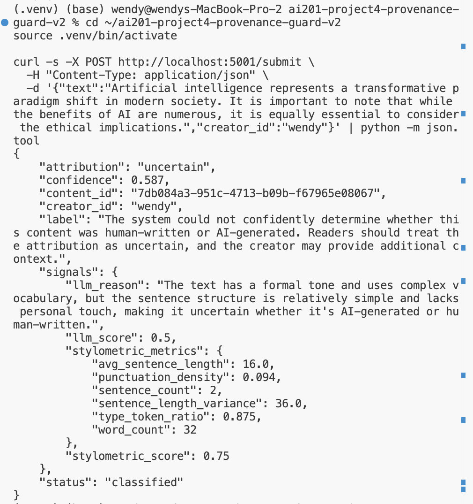
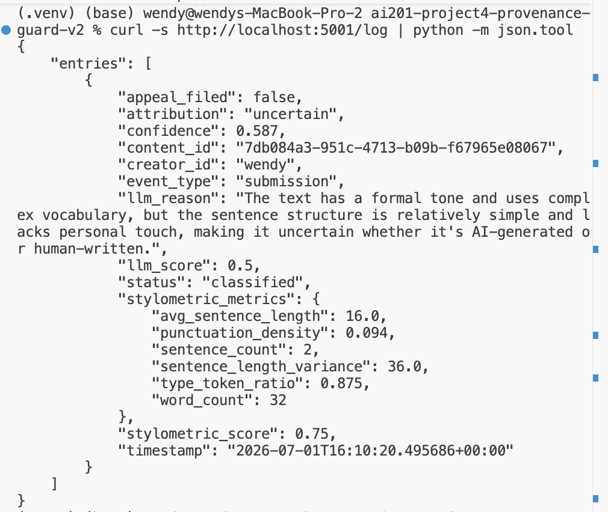
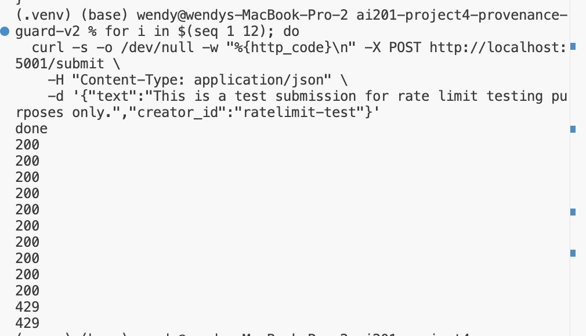

# Provenance Guard

1. Project Overview
2. Architecture Overview
3. Detection Signals
4. Confidence Scoring
5. Transparency Labels
6. API Endpoints
7. Audit Log
8. Rate Limiting
9. Known Limitations
10. Spec Reflection
11. AI Usage
12. Future Improvements

# Provenance Guard

## Project Overview

Provenance Guard is a Flask-based backend service that estimates whether submitted text is likely human-written or AI-generated. Instead of making a binary decision, the system combines multiple detection signals to generate a confidence score, presents a transparency label, stores every decision in an audit log, and provides an appeals workflow for creators who disagree with the result.

The goal of the project is not to perfectly detect AI-generated content, but to provide transparent, explainable, and auditable attribution decisions while acknowledging uncertainty.

---

# Architecture Overview

## Submission Flow

```
                POST /submit
                      │
                      ▼
             Validate Request
                      │
          ┌───────────┴───────────┐
          ▼                       ▼
   LLM Detection          Stylometric Analysis
          │                       │
          └───────────┬───────────┘
                      ▼
            Confidence Scoring
                      ▼
          Attribution Classification
                      ▼
          Transparency Label Generator
              │                 │
              ▼                 ▼
        Audit Log         JSON Response
```

## Appeal Flow

```
POST /appeal
      │
      ▼
Validate Content ID
      ▼
Update Status → under_review
      ▼
Store Creator Reasoning
      ▼
Update Audit Log
      ▼
Return Confirmation
```

---

# Detection Signals

## Signal 1 – LLM-Based Detection

The first signal uses Groq's Llama 3.3 model to analyze the writing style and estimate the likelihood that a submission is AI-generated.

Output:

- AI likelihood score (0–1)
- Natural language explanation

Strengths

- Understands semantic consistency
- Evaluates writing style holistically
- Detects common AI writing patterns

Limitations

- Formal human writing may resemble AI
- Performance decreases on very short passages

---

## Signal 2 – Stylometric Analysis

The second signal computes measurable writing characteristics.

Metrics include:

- Average sentence length
- Sentence length variance
- Type-token ratio
- Word count
- Punctuation density

Output

- Stylometric score (0–1)
- Detailed metrics dictionary

Strengths

- Fast
- Explainable
- Deterministic

Limitations

- Poems
- Academic papers
- Non-native English writing
- Very short submissions

---

# Confidence Scoring

The final confidence score combines both detection signals.

Weighting

- LLM Detection: **60%**
- Stylometric Analysis: **40%**

Classification thresholds

| Confidence | Classification |
|------------|----------------|
| 0.00–0.39 | Likely Human |
| 0.40–0.69 | Uncertain |
| 0.70–1.00 | Likely AI |

This conservative scoring strategy intentionally reduces false positives by requiring stronger evidence before labeling content as AI-generated.

## Example 1

Input:

> Artificial intelligence represents a transformative paradigm shift in modern society...

Output

```
Confidence: 0.587
Classification: Uncertain
```

Although the writing is formal, the two detection signals disagreed enough that the system returned an uncertain classification.

## Example 2

Input:

> ok so i finally tried that new ramen place downtown and honestly? it wasn't nearly as good as everyone said...

Expected Output

```
Confidence: ~0.30
Classification: Likely Human
```

The casual style, irregular sentence structure, and conversational vocabulary produce a lower AI likelihood score.

---

# Transparency Labels

## High-Confidence AI

> This content is likely AI-generated based on multiple detection signals. Readers should interpret it accordingly.

---

## High-Confidence Human

> This content is likely written by a human author. No significant AI indicators were detected.

---

## Uncertain

> The system could not confidently determine whether this content was human-written or AI-generated. Readers should treat the attribution as uncertain, and the creator may provide additional context.

---

# API Endpoints

## POST /submit

Submits text for attribution analysis.

Input

```json
{
  "text": "...",
  "creator_id": "wendy"
}
```

Response

```json
{
  "content_id": "...",
  "creator_id": "...",
  "confidence": 0.587,
  "attribution": "uncertain",
  "signals": {
    "llm_score": 0.5,
    "stylometric_score": 0.75
  },
  "label": "...",
  "status": "classified"
}
```

## Example Response

The following screenshot shows the JSON response returned by the `/submit` endpoint.



---

## POST /appeal

Allows creators to challenge a classification.

Input

```json
{
  "content_id":"...",
  "creator_reasoning":"..."
}
```

Response

```json
{
  "message":"Appeal received.",
  "status":"under_review"
}
```


---

## GET /log

Returns recent audit log entries.

---

# Audit Log

Every submission stores:

- timestamp
- content_id
- creator_id
- attribution
- confidence score
- LLM score
- Stylometric score
- Transparency status
- Appeal information (if applicable)

Example fields

```json
{
  "event_type":"submission",
  "confidence":0.587,
  "status":"classified",
  "appeal_filed":false
}
```

Appeals update the existing submission and create a separate appeal entry.

## Audit Log

The audit log records every submission and appeal.




---

# Rate Limiting

Flask-Limiter protects the submission endpoint.

Limits

```
10 requests per minute
100 requests per day
```

Reasoning

A typical writer submits only a few drafts during an editing session. These limits comfortably support normal usage while discouraging automated abuse and repeated probing of the classifier.

Testing

```
200
200
200
200
200
200
200
200
200
200
429
429
```

The final two requests correctly exceeded the configured rate limit.

## Rate Limiting

The following test demonstrates that the configured request limit is enforced correctly.


---

# Known Limitations

The system is intentionally conservative and has several known limitations.

Examples include:

- Poetry with repetitive language
- Academic writing
- ESL writers
- AI-generated text heavily edited by humans
- Very short submissions

Perfect AI detection remains an unsolved problem. This system emphasizes transparency rather than certainty.

---

# Spec Reflection

Writing the planning document before implementation helped define the architecture, confidence thresholds, API contracts, and audit log structure before coding began.

One implementation difference was improving the audit log by storing both the original submission and a separate appeal event, making the system easier to inspect and debug.

---

# AI Usage

AI was used as an engineering assistant throughout development.

Examples include:

- Generating the initial Flask application structure and endpoint skeleton.
- Assisting with the stylometric analysis implementation.
- Reviewing confidence scoring logic.
- Suggesting improvements to audit log structure.
- Helping debug Flask, virtual environment, and Groq API configuration issues.

All generated code was reviewed, tested, and modified before being integrated into the final project.

---

# Future Improvements

Potential future enhancements include:

- Additional detection signals
- Better confidence calibration
- Human reviewer dashboard
- SQLite database instead of JSON logging
- User authentication
- Analytics dashboard
- Verified human certificates
- Multi-modal support for images and metadata